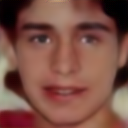

# FSRNet: End-to-End Learning Face Super-Resolution with Facial Priors

Tensorflow implement FSRNet based on [SRN-Deblur](https://github.com/jiangsutx/SRN-Deblur/)


## Testing

Download pretrained models and unzip, make sure the model path is ./checkpoints/color/checkpoints/deblur.model*

`--input_path=<TEST_FOLDER>` and save the outputs to `--output_path=<OUTPUT_FOLDER>`.
For example:

```bash
python run_model.py --input_path=./testing_set --output_path=./testing_res --gpu=0 --model=color --phase=test --height=128 --width=128
```


| HR | SR |
| ------ | ------ |
| |  |

 

## Training

1. use data_loader.py to generate tfrecords in main function
2. Hyper parameters such as batch size, learning rate, epoch number can be tuned through command line:

```bash
python run_model.py --phase=train --batch=16 --lr=1e-4 --epoch=500
```


## Some problems

1. Since the author do not open the code of cropping the face, so the dataset i use is different from theirs, our face is bigger than theirs.
2. I use [face alignment](https://github.com/1adrianb/face-alignment) to generate landmarks.
3. Download model from [model](https://pan.baidu.com/s/1HBzZmcty45dhhUz-uGnMLw) 
password: 0z3l 


